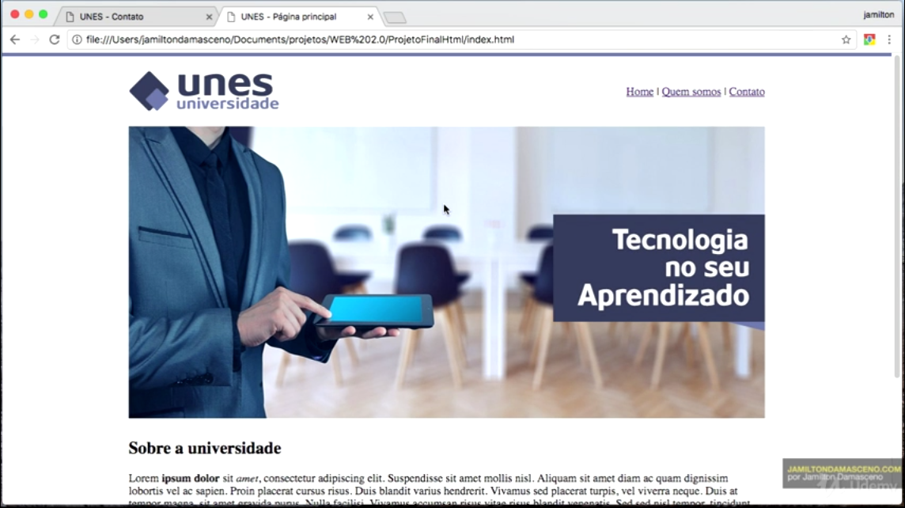

# UNES
Projeto do curso do Jamilton Damasceno feito pra colocar o HTML em dia. <strong>Com 0% de CSS.</strong>

<h5>Nesse projeto foi utilizado table ao invés de div apenas para treinamento.</h5>

	

<h6>Feito com ♥ por Robson! Apenas para teste.</h6>
